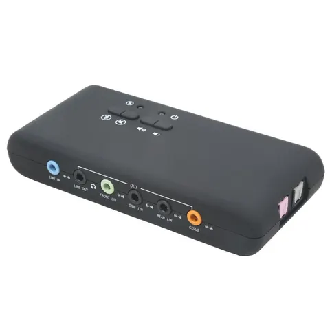
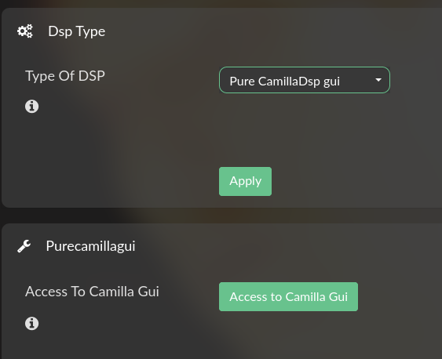
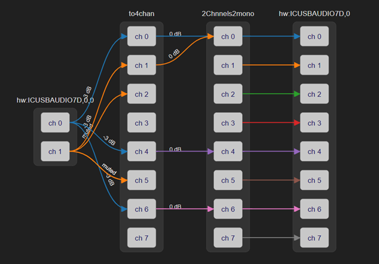
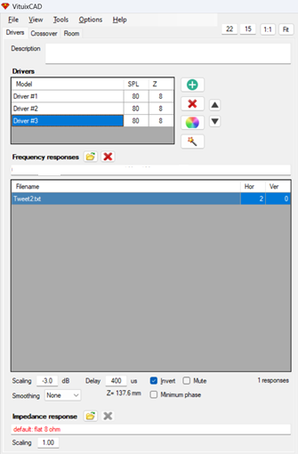

Внешняя USB звуковая карта на cm6206 7.1  
В линуксе как ICUSBAUDIO7D  

{:class="img-responsive"}  

* Понадобится.  
1. Raspberry Pi или PC (X86/X64)  
2. USB карта с несколькими выходами с поддержкой в Linux (взята cm6206)  
3. Стерео усилители по количеству полос колонки (у меня 3)  
4. Сами колонки (Heco Victa 700)  
5. Паяльник (удалить фильтры и припаять конденсатор на пищалку)  
6. Пучёк проводов для соединения всего со всем  
7. Измерительный микрофон  
8. Второй компьютер с установленной программой [REW](https://www.roomeqwizard.com/)  

* Начать:  

По инструкции запустить [Volumio OS](https://volumio.com/get-started/)  
В секции плагины - поставить FusionDSP
В настройках плагина выбрать  Pure CamillaDSP gui  

  

Жмакнуть кнопку Access to Camilla gui  

и вот оно..  

  

Теперь на странице http:\\\\volumio.local\\**dev** включить терминал  

в терминале запустить alsamixer   
F6 для выбора карты (у меня ICUSBAUDIO7D), на вход выбрать Line  

Загрузить [файл](../images/camilla/LINE_IN_MEAS_v2.yml)  

Применить...

Ко входу подключить выход компа с REW  

<s>Запустить музло..</s>  

* Можно мерять.  

Мерять каждый канал, отключая остальные в Mixer-е (не забывать загружать в DSP)  

Конфиг сделан для измерения с Use Acoustic Timing Reference  

По результатам  разработать фильтры, добавить в Filters и их добавить в Pipeline  

Добавить задержки, инверсию канала - для получения красивого импульса  

В [этом](https://www.youtube.com/watch?v=5x1hHGyCs_U) видео про импульс есть, ну и метод настройки  
И [тут](https://vk.com/video/@maxspace_lab?z=video-19259244_456239048%2Fclub19259244%2Fpl_-19259244_-2) *Выставляем тайм офсет*  

Импульс без задержки твитера  

  

Стремиться надо примерно к этому..

  

  

***  

**Измерения**  

Для симуляции фильтров использовал программу [VituixCAD](https://kimmosaunisto.net/)  

Переключил DSP на аналоговый вход Line  

Настройки для измерений предусматривают метод измерения с акустическим импульсом.  

  

Это начало
  

Во всех случаях синхроимпульс идёт мимо фильтров.  

Это даёт довольно точное измерение фазы относительно каждого динамика.  

Так как на моих колонках НЧ и СЧ реализованы на одинаковых динамиках - между ними задержка не нужна.  

Остаётся свести твитер и мид.  

Смотреть по импульсу. Проверив сначала у каждого динамика отдельно, что-бы смотрел вверх.  

В поцессе в зависимости от применяемых фильтров, возможно надо будет поменять сигнал.  

  

Измерения на ВЧ, СЧ чистил в окне IR Window значением 5ms в Right Window  

  

После этого измерения экспортировал в текст и загружал в VituixCAD

  

Дальше сводил первым ВЧ и СЧ.  

После применения фильтров можно менять Delay во вкладке Drivers  

  

Дальше фильтры набирам в CamillaDSP  

Измерения с фильтрами можно экспортировать в VituixCad, но не забывать отключать фильтры и инверсию в программе, так как они уже применены в CamillaDSP при измерении.  
Это даёт фазу очень близкую к оригинальной.  
И Delay почти совпадает.  

Можно и без VituixCad, но дольше..

Добиваемся ровной АЧХ и красивого импульса (фильтрами и задержками)...

В результате будет похожий набор  
  

Получившиеся фильтры копируем по каналам и слушаем...

Удачи!!

Спасибо реаниматору за огромный вклад в популяризацию [ИТУН-ов](https://reanimator-h.narod.ru/it_nun.htm)  

